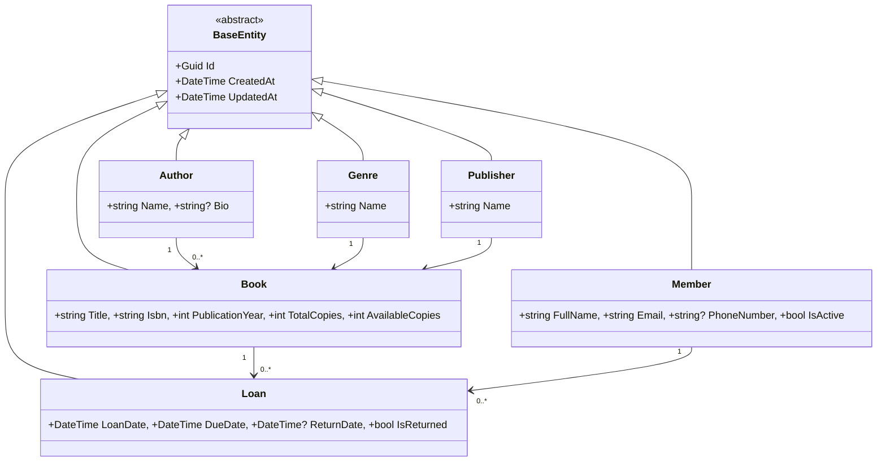

# Library Management API

A REST API for managing a library catalog and circulation (checkout/return), built with ASP.NET Core 8, Clean Architecture, and MediatR/CQRS.

## Tech Stack

| Layer | Technology |
|---|---|
| Framework | .NET 8, ASP.NET Core 8 |
| Database | PostgreSQL 16 (EF Core 8) |
| CQRS / Mediator | MediatR 12 |
| Validation | FluentValidation |
| API Docs | Swagger / Swashbuckle |
| Testing | xUnit, FluentAssertions, WebApplicationFactory |
| Containerization | Docker Compose |

## Architecture

Clean Architecture with four projects — dependencies point strictly inward:

```
LibraryManagement.Domain       ← entities, exceptions (no dependencies)
LibraryManagement.Application  ← commands, queries, validators (MediatR + FluentValidation)
LibraryManagement.Infrastructure ← EF Core, PostgreSQL, migrations
LibraryManagement.API          ← controllers, middleware, DI composition root
```



## API Endpoints

### Catalog
| Method | Route | Description |
|---|---|---|
| GET | `/api/Authors` | List authors (paginated, sortable, filterable by name) |
| GET | `/api/Authors/{id}` | Get author by ID |
| POST | `/api/Authors` | Create author |
| PUT | `/api/Authors/{id}` | Update author |
| DELETE | `/api/Authors/{id}` | Delete author (blocked if author has books) |
| GET/POST/PUT/DELETE | `/api/Books` | CRUD — filter by title, ISBN, author, genre, year, availability |
| GET/POST/PUT/DELETE | `/api/Genres` | CRUD |
| GET/POST/PUT/DELETE | `/api/Publishers` | CRUD |

### Members
| Method | Route | Description |
|---|---|---|
| GET/POST/PUT/DELETE | `/api/Members` | CRUD — filter by name, email, active status |

### Circulation
| Method | Route | Description |
|---|---|---|
| POST | `/api/Loans` | Checkout a book (requires available copies + active member) |
| POST | `/api/Loans/{id}/return` | Return a book |
| GET | `/api/Loans` | List loans — filter by member, book, returned, overdue |
| GET | `/api/Loans/{id}` | Get loan by ID |

## Pagination, Sorting & Filtering

All list endpoints return a `PagedResult<T>` envelope:

```json
{
  "items": [...],
  "pageNumber": 1,
  "pageSize": 10,
  "totalCount": 42,
  "totalPages": 5
}
```

**Query parameters** (all optional):

| Parameter | Default | Description |
|---|---|---|
| `pageNumber` | 1 | Page to fetch |
| `pageSize` | 10 | Items per page (max 50) |
| `sortBy` | `createdAt` | Sort field (whitelisted per endpoint) |
| `sortDescending` | false | Sort direction |
| *entity-specific* | | e.g. `title`, `isbn`, `authorId`, `isAvailable` for Books |

**Example:**
```
GET /api/Books?title=1984&sortBy=title&sortDescending=false&pageNumber=1&pageSize=5
GET /api/Loans?isOverdue=true&sortBy=dueDate
GET /api/Authors?name=Orwell&sortBy=name
```

## Quick Start

### Docker Compose (recommended)

```bash
docker compose up -d
# API: http://localhost:8080
# Swagger UI: http://localhost:8080/swagger
# PostgreSQL: localhost:5432 (user: postgres, pass: postgres, db: librarymanagement)
```

Auto-migrates the database and seeds demo data on first startup (Orwell, Austen, Hemingway, 3 books, 2 members).

### Local (without Docker)

Requires .NET 8 SDK and a running PostgreSQL instance.

```bash
# Update connection string in LibraryManagement.API/appsettings.Development.json
dotnet restore
dotnet run --project LibraryManagement.API
```

## Testing

```bash
dotnet test
# 10 unit tests (handlers + validators, EF InMemory)
# 5 integration tests (full HTTP cycle, WebApplicationFactory + SQLite)
```

## Project Structure

```
LibraryManagement/
├── LibraryManagement.Domain/          Entities, exceptions
├── LibraryManagement.Application/     Commands, queries, DTOs, validators
│   ├── Authors|Books|Genres|Loans|Members|Publishers/
│   │   ├── Commands/                  Write operations (Create, Update, Delete)
│   │   ├── Queries/                   Read operations (GetById, GetAll)
│   │   ├── Dtos/                      Input/output contracts + filters
│   │   └── Validators/                FluentValidation rules
│   └── Common/                        IAppDbContext, PagedResult, ValidationBehavior
├── LibraryManagement.Infrastructure/  EF Core DbContext, migrations, configurations
├── LibraryManagement.API/             Controllers, middleware, Program.cs
├── tests/
│   ├── LibraryManagement.UnitTests/
│   └── LibraryManagement.IntegrationTests/
├── docs/                              UML diagrams (PlantUML sources)
└── compose.yaml                       Docker Compose (PostgreSQL + API)
```

## Seed Data

On first startup the database is populated with:
- **3 Authors:** George Orwell, Jane Austen, Ernest Hemingway
- **3 Genres:** Dystopian, Romance, Adventure
- **2 Publishers:** Penguin Books, HarperCollins
- **3 Books:** 1984, Pride and Prejudice, The Old Man and the Sea
- **2 Members:** Alice Johnson, Bob Smith

## Deployment (Render — free tier)

GitHub Pages is static-only and cannot host APIs. This project deploys to [Render](https://render.com) with a free PostgreSQL instance:

1. Push this repo to GitHub (already done)
2. Go to [render.com](https://render.com) → **New** → **Blueprint** → connect your GitHub repo
3. Render reads `render.yaml` and creates:
   - A free PostgreSQL database (auto-provisioned)
   - A free web service running the Dockerfile
4. The API auto-migrates and seeds on first boot
5. Swagger UI is available at `https://your-app.onrender.com/swagger`

> **Note:** Render free tier spins down after 15 min of inactivity (cold start ~30s). For always-on, upgrade to the paid tier or use [Fly.io](https://fly.io).

Other free options: [Railway](https://railway.app) ($5/month credit), [Koyeb](https://koyeb.com) (2 free services), [Azure App Service](https://azure.microsoft.com/free/app-service/) (F1 free tier).

## License

MIT
